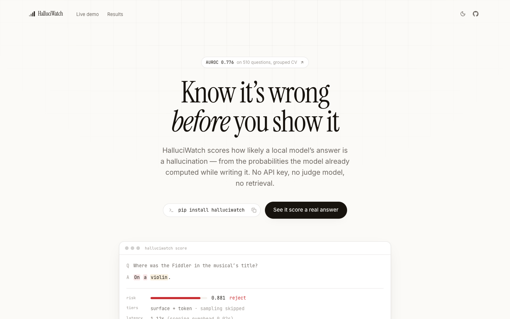
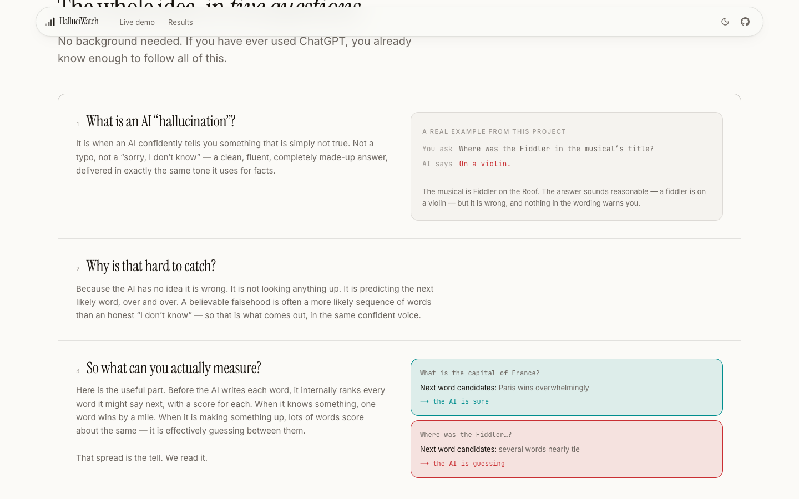
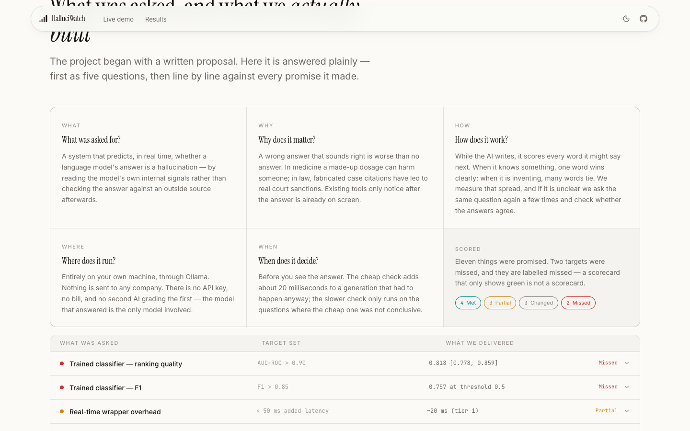
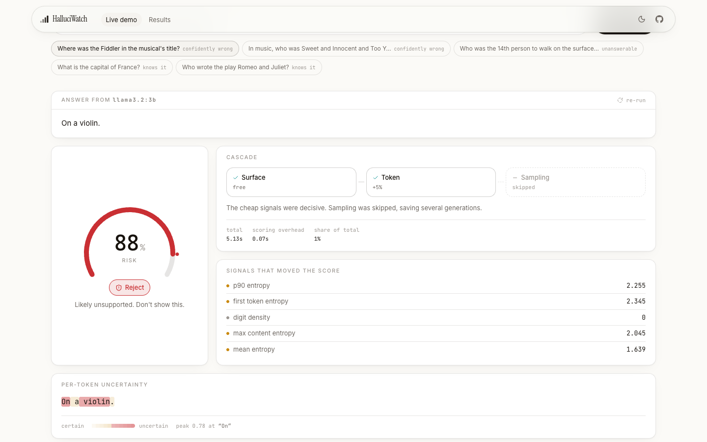
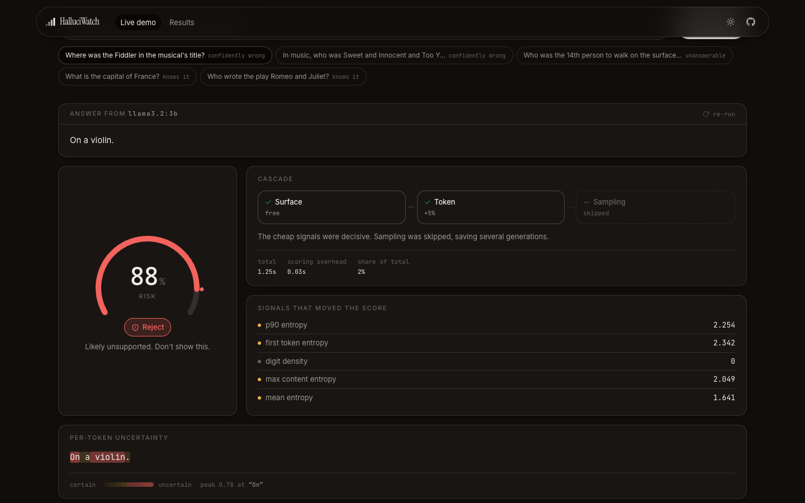
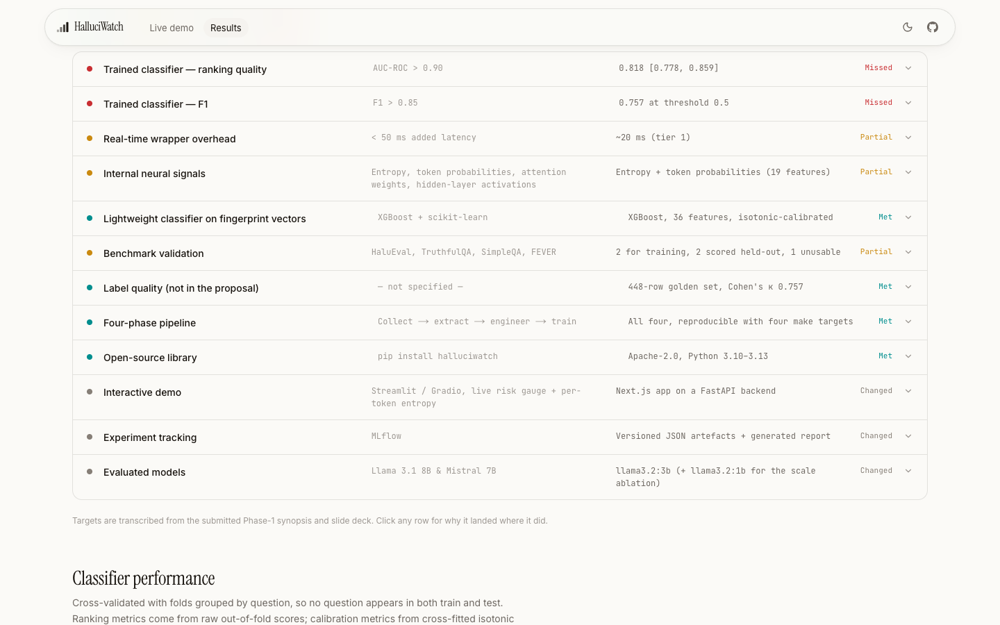
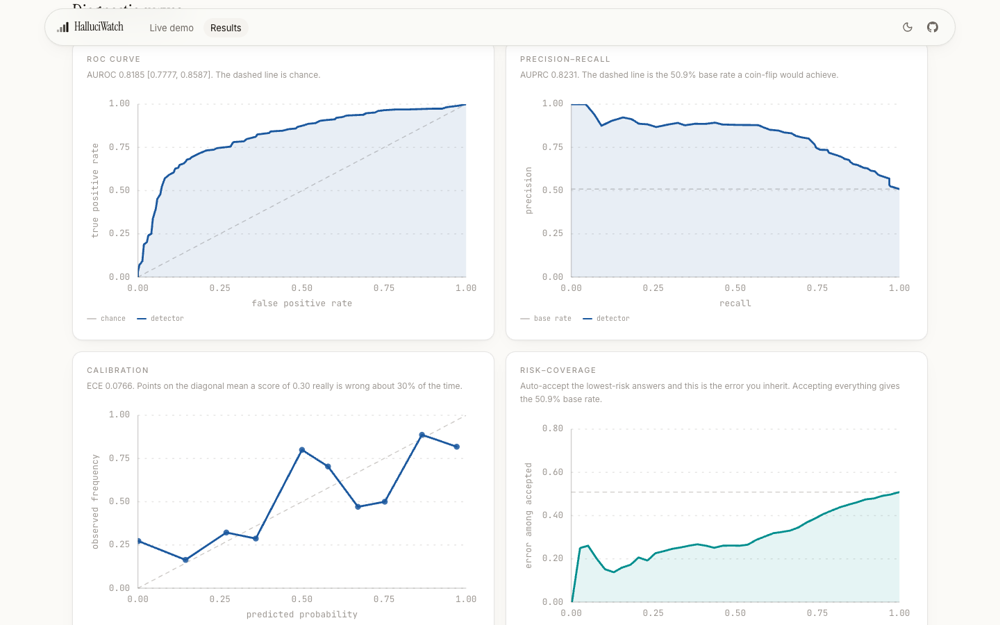
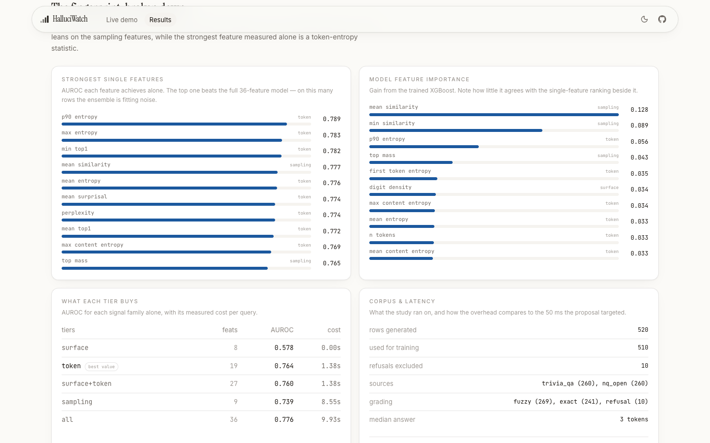
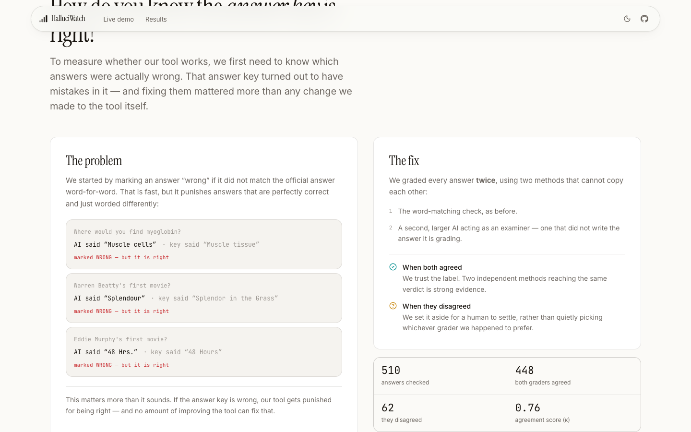

<div align="center">

# HalluciWatch

### Hallucination Fingerprinting in Large Language Models
**A real-time hallucination risk detection system that runs entirely on your machine.**

[](LICENSE)
[](https://www.python.org)
[](https://ollama.com)
[](backend/tests)
[](backend/RESULTS.md)
[](#golden-test-set)

*B.E. Computer Science & Engineering · 2025–26 · Phase 1*

</div>

<p align="center">
  
</p>

---

## What this is

An LLM produces fluent, confident text whether it is stating a verified fact or
inventing one. HalluciWatch reads the **probability distribution the model
computes at every token while it writes** and turns it into a calibrated risk
score — *before* the answer reaches the user.

No API keys. No judge model. No vector database. No retrieval index.
The model runs locally through [Ollama](https://ollama.com) and scores itself.

```bash
pip install halluciwatch
ollama pull llama3.2:3b && ollama pull nomic-embed-text
halluciwatch score "Where was the Fiddler in the musical's title?"
```

```
Q  Where was the Fiddler in the musical's title?
A  On a violin.

   risk    █████████████████████████░░░  0.881 (reject)
   tiers   surface+token   latency 1.12s (overhead 0.02s)
   note    tier-1 risk 0.88 outside escalation band [0.2, 0.8]; skipped sampling
```

It is *Fiddler on the **Roof***. The model is fluent, confident and wrong — and
the verdict cost **20 milliseconds** on top of a generation that had to happen
anyway, because the cheap signals were already decisive and the cascade never
paid for the expensive tier.

---

## How it works, in plain language

<p align="center">
  
</p>

The landing page explains the whole idea assuming no background at all:

1. **What is a hallucination?** An AI confidently telling you something untrue —
   in the same tone it uses for facts. Ask *"Where was the Fiddler in the
   musical's title?"* and it answers *"On a violin."* It is *Fiddler on the
   **Roof***.
2. **Why is it hard to catch?** The AI is not looking anything up. It predicts
   the next likely word, and a believable falsehood is often more likely than an
   honest "I don't know".
3. **What can you measure?** Before writing each word, the AI ranks every word it
   might say next. When it knows something, one word wins by a mile. When it is
   inventing, many words nearly tie. **That spread is the tell.**
4. **What if that's unclear?** Ask the same question a few more times. An AI that
   knows gives the same answer every time; one that is inventing gives a
   different story each time.
5. **What do you get?** A number from 0 to 1 and a verdict — accept, review,
   reject, or abstain.

---

## Requirements checklist

Everything the Phase-1 synopsis and slide deck specified, and how it was
implemented. Two targets were missed; they are marked missed.

<p align="center">
  
</p>

### The five questions

| | Question | Answer |
|---|----------|--------|
| **What** | What was asked for? | A system that predicts, in real time, whether an AI's answer is a hallucination — by reading the model's own internal signals rather than fact-checking the output afterwards |
| **Why** | Why does it matter? | A wrong answer that sounds right is worse than no answer. Existing tools only notice after it is already on screen |
| **How** | How does it work? | Measure how spread-out the model's next-word choices are; if that is unclear, ask again several times and check whether the answers agree |
| **Where** | Where does it run? | Entirely on your machine through Ollama. No API key, no bill, no second AI grading the first |
| **When** | When does it decide? | Before you see the answer — about 20 ms on top of a generation that had to happen anyway |

### Deliverables (Slide 11 · Synopsis §7)

| # | Required | Target | Delivered | Status |
|---|----------|--------|-----------|--------|
| 1 | Trained classifier — ranking | AUC-ROC > 0.90 | **0.818** [0.778, 0.859] | ❌ Missed |
| 2 | Trained classifier — F1 | F1 > 0.85 | **0.757** (best-threshold 0.763) | ❌ Missed |
| 3 | Real-time wrapper | < 50 ms added latency | **~20 ms** on the cheap tier | ⚠️ Partial |
| 4 | Open-source library | `pip install halluciwatch` | Apache-2.0, Python 3.10–3.13 | ✅ Met |
| 5 | Interactive demo | Live risk gauge + per-token entropy | Next.js + FastAPI app | 🔄 Changed |

### Methodology — four-phase pipeline (Slide 9 · Synopsis §4)

| Phase | Required | Implemented | Where |
|-------|----------|-------------|-------|
| 1 · Data collection | Prompt an LLM with benchmark questions, label each response | 520 answers from `llama3.2:3b`, graded by normalised exact-match then token-F1 against gold aliases | [`data/build.py`](backend/src/halluciwatch/data/build.py) |
| 2 · Signal extraction | Entropy, token probabilities, attention weights, hidden states | Per-token logprobs + top-20 alternatives. Attention/hidden states **not exposed by Ollama** — a self-consistency tier covers the gap | [`backends/ollama.py`](backend/src/halluciwatch/backends/ollama.py) |
| 3 · Feature engineering | Aggregate into a fixed-length fingerprint vector | **36 named features** across 3 tiers, order-stable via a registry | [`features/`](backend/src/halluciwatch/features) |
| 4 · Classifier training | XGBoost, evaluate with F1 / AUC-ROC / precision / recall | XGBoost + grouped CV + isotonic calibration + conformal thresholds | [`model.py`](backend/src/halluciwatch/model.py) |

### Signals (Synopsis §4.1)

| Signal | Required | Status | Note |
|--------|----------|--------|------|
| Entropy | ✔ | ✅ | mean, max, p90, std, content-token-restricted |
| Token probability distributions | ✔ | ✅ | top-20 alternatives per token, margin, min-top1 |
| Attention weights | ✔ | ❌ | **Not exposed by Ollama.** Would require HF Transformers with `attn_implementation="eager"` |
| Hidden-layer activations | ✔ | ❌ | **Not exposed by Ollama.** Same constraint |
| *Semantic entropy (added)* | — | ✅ | Not in the proposal; added to compensate for the two above |

### Datasets (Slide 10 · Synopsis §6.3)

| Dataset | Required | Status | Note |
|---------|----------|--------|------|
| HaluEval | ✔ (35K) | ⚠️ Loader ships | Answers written by *other* models; Ollama cannot return logprobs for text it did not generate, so the token tier is unavailable |
| TruthfulQA | ✔ (817) | ✅ Scored held-out | 123 questions — the model answers **3** correctly |
| SimpleQA | ✔ (~4K) | ✅ Scored held-out | 104 questions — the model answers **1** correctly |
| FEVER | ✔ (185K) | ❌ Not used | Claim *verification*, not generation — does not fit a generation-time detector |
| *TriviaQA + NQ-Open (added)* | — | ✅ Primary | 520 rows at a 51.8% base rate, where a detector actually has something to separate |

### Technology stack (Slide 10 · Synopsis §6)

| Layer | Proposed | Used | Why |
|-------|----------|------|-----|
| Model | Llama 3.1 8B, Mistral 7B | `llama3.2:3b` (+ `1b` for a scale ablation) | 8 GB machine; an 8B model leaves no headroom for the K-sample tier |
| Extraction | PyTorch hooks + baukit | Ollama HTTP API | The project brief specified a **local** runtime; Ollama is that runtime |
| Classifier | XGBoost + scikit-learn | XGBoost + scikit-learn | ✅ as specified |
| Interface | Streamlit / Gradio | Next.js + FastAPI | Same surface, built as a real web app |
| Tracking | MLflow | Versioned JSON artefacts | MLflow's server + DB was overhead an 8 GB laptop could not justify |

### Literature review (Slides 6–8 · Synopsis §5)

All **15 papers** — 7 fingerprinting, 5 detection & theory, 3 benchmarks — are
tabulated on the [dashboard](#the-dashboard) with topic, method and key finding.

---

## Live demo

Runs against a real local model. The answer and the risk come from the **same
forward pass** — there is no second model grading the first.

<p align="center">
  
</p>

The risk dial, the cascade trail (note **sampling skipped**), the signals that
moved the score, and the per-token uncertainty heat-map — all from one request.

<details>
<summary><b>Dark theme</b></summary>
<p align="center">
  
</p>
</details>

---

## The dashboard

Every deliverable scored against the Phase-1 proposal, including the misses.

<p align="center">
  
</p>

Full diagnostic curves — ROC, precision–recall, calibration and risk–coverage:

<p align="center">
  
</p>

The fingerprint broken down, with the single-feature ranking and the model's own
gain side by side — note how little they agree:

<p align="center">
  
</p>

> Every number on the dashboard is written by
> [`scripts/export_dashboard.py`](backend/scripts/export_dashboard.py) from the
> corpus and the trained model. Nothing is hand-entered.

---

## Results

`llama3.2:3b` · **448 verified rows** from TriviaQA + NQ-Open · 5-fold CV
**grouped by question** so no question appears in both train and test · 50.9%
base rate.

| Metric | Value |
|--------|-------|
| AUROC | **0.818** [0.778, 0.859] |
| AUPRC | 0.823 |
| F1 @ 0.5 | 0.757 (best across thresholds: 0.763) |
| ECE (cross-fitted) | 0.077 |
| Brier | 0.180 |

### How it got there

Two rounds of legitimate improvement, both driven by a diagnostic rather than a
hyperparameter sweep:

| Stage | AUROC | What changed |
|-------|-------|--------------|
| Initial | 0.776 | depth-4 XGBoost, string-matched labels |
| + capacity fix | 0.793 | The ensemble scored **below its own best single feature** — a memorisation signature on 510 rows. Depth-1 stumps with strong L2 recovered +0.017 |
| + verified labels | **0.818** | Dual-grading found **12% label noise**; training on the 448 agreed rows added +0.025 |

The remaining gap to 0.90 is not a tuning problem. F1 tops out at 0.763 across
*all* thresholds, so it is bounded by ranking quality, and closing that needs
signals Ollama does not expose — attention maps and hidden states.

### The measurement the architecture rests on

| Tiers | Features | AUROC | Cost/query |
|-------|----------|-------|-----------|
| surface | 8 | 0.588 | 0.00 s |
| **token** | 19 | **0.810** | **1.38 s** |
| surface + token | 27 | 0.810 | 1.38 s |
| sampling | 9 | 0.776 | 8.55 s |
| all three | 36 | 0.818 | 9.93 s |

**Adding semantic entropy costs 7× the latency for +0.008 AUROC**, and the
confidence intervals overlap almost entirely. That is why the detector escalates
to it only inside an uncertainty band instead of always paying.

---

## Golden test set

<p align="center">
  
</p>

**In one line:** before you can measure whether the tool is right, you have to
be sure the answer key is right — and ours wasn't.

Every metric is only as good as the labels beneath it. The corpus was first
labelled by string matching against gold aliases — precise, but too strict on
paraphrase. Spot-checking found real mislabels:

| Question | Model said | Gold | String verdict |
|----------|-----------|------|----------------|
| Where would you find myoglobin? | "Muscle cells (skeletal and cardiac)" | "Muscle tissue" | ❌ hallucination |
| Warren Beatty's first movie? | "Splendour" | "Splendor in the Grass" | ❌ hallucination |
| Eddie Murphy's first movie? | "48 Hrs." | "48 Hours" | ❌ hallucination |

All three are correct answers being punished for spelling. **Label noise puts a
hard ceiling on achievable AUROC**, because the detector is penalised for
correctly scoring an answer that was in fact right.

### Method

Standard inter-rater practice, run locally:

1. **Grade every answer twice** — the string matcher, and an independent
   `qwen2.5:7b-instruct` judge that did *not* generate the answer.
2. **Agreement → verified.** Two independent methods reaching the same verdict
   is strong evidence.
3. **Disagreement → contested.** Written out in full for human adjudication
   rather than silently resolved by whichever rater we happened to trust.
4. **Report Cohen's κ**, so labelling reliability is itself a measured number.

```bash
make golden      # writes golden.jsonl + contested.jsonl + κ statistics
```

### Result

| | |
|---|---|
| Rated | 510 |
| **Verified (agreed)** | **448** (87.8%) |
| Contested (disagreed) | 62 (12.2%) |
| **Cohen's κ** | **0.757** — *substantial* (Landis & Koch) |
| Disagreement direction | 36 string-strict, 26 string-lenient |

Training on the 448 verified rows raised AUROC from 0.793 to **0.818** —
a bigger gain than any change made to the detector itself.

| | AUROC | what changed |
|---|-------|--------------|
| Before | 0.776 | original model, string-matched labels |
| After model fix | 0.793 | depth-1 stumps instead of depth-4 trees |
| **After clean key** | **0.818** | trained only on the 448 verified rows |

> **Caveat, stated plainly.** The second grader is an AI too, so this is a
> cross-check rather than human ground truth. That is exactly why the 62
> disagreements are written to `contested.jsonl` for a person to settle rather
> than being resolved automatically — and why κ is reported instead of a claim
> that the labels are now perfect.

> **The judge must be a different and larger model than the generator.** At 3B,
> `llama3.2` agreed with the string matcher on 239 of 264 items and overturned
> **none** — including the demonstrably mislabelled ones. Validated on six known
> cases, the 3B judge scored 2/6; `qwen2.5:7b` scored **6/6** at confidence 1.00.
> Judging your own output shares its blind spots.

---

## What didn't work

Four measurements that make this project look worse, published because a
detector you cannot audit is worth nothing.

| Finding | Numbers |
|---------|---------|
| **A single feature still edges out the whole model.** `tok.p90_entropy` alone beats all 36 combined. Catching this at 0.789 vs 0.776 is what prompted the capacity fix; the gap narrowed but never reversed. | 0.823 vs 0.818 |
| **Self-verification is chance.** P(True) measured at exactly 0.500 AUROC on a 1B model, and *adding* it dropped the combined model from 0.872 to 0.841. Tier 3 ships **off by default**. | AUROC 0.500 |
| **Surface features hurt.** Token signals alone still edge out token-plus-surface. | 0.8104 → 0.8095 |
| **Adversarial benchmarks can't measure a detector at this scale.** On TruthfulQA + SimpleQA the model answers **4 of 227** correctly — there is almost nothing left to rank against. | 4 / 227 |

### Two engineering bugs worth documenting

**`top_logprobs` is free-or-full.** Measured on an M1 with 60 generated tokens:
`top_logprobs=0` costs +5.2%, but `=1` costs +77% and `=20` costs +81%. The
penalty for requesting *any* alternatives is fixed, so never ask for k between 1
and 19 — take 0 or 20.

**Ollama does not lower-case for uncased embedding models.** `nomic-embed-text`
is BERT-uncased, so every capitalised token becomes `[UNK]`:

| Pair | Raw cosine | Lower-cased |
|------|-----------|-------------|
| "The capital of France is Paris." vs "The capital of Japan is Tokyo." | **1.0000** | 0.7212 |
| "John Logie Baird" vs "Philo Farnsworth" | **0.9786** | 0.4020 |

Two different facts scored as *identical*. Every semantic-consistency feature
built on this would have been noise that looked like signal.

---

## Architecture

```
question
   │
   ▼
OllamaBackend.generate(logprobs=True, top_logprobs=20)   ← the answer you wanted
   │
   ├─ tier 0  surface features        free
   ├─ tier 1  token distribution      +5%
   │
   ├─ cheap risk inside [0.2, 0.8]? ──no──► score
   │            │yes
   │            ▼
   ├─ tier 2  K samples → cluster by meaning → semantic entropy
   │
   ▼
fingerprint (36 features) → XGBoost → isotonic calibration
   │
   ▼
DecisionPolicy → accept / review / reject / abstain
```

<details>
<summary><b>Project structure</b></summary>

```
hallucination/
├── backend/
│   ├── src/halluciwatch/
│   │   ├── backends/ollama.py   Ollama client; both documented bugs live here
│   │   ├── features/            the four signal tiers, self-documenting
│   │   ├── cluster.py           meaning-clustering for semantic entropy
│   │   ├── detector.py          cascade orchestration
│   │   ├── calibration.py       isotonic + conformal thresholds
│   │   ├── model.py             training, grouped CV, persistence
│   │   ├── evaluation/          metrics, bootstrap CIs, tier ablation
│   │   ├── server.py            FastAPI + SSE
│   │   └── cli.py               doctor / build / train / ablate / score / serve
│   ├── scripts/
│   │   ├── golden_set.py        dual-grading + Cohen's kappa
│   │   └── export_dashboard.py  every dashboard number
│   ├── tests/                   100 tests (86 unit, 14 live-integration)
│   └── RESULTS.md               generated, never hand-edited
└── website/                     Next.js 16 · 3 routes: /, /demo, /dashboard
```
</details>

---

## Quick start

```bash
# 1. Local model through Ollama
brew install ollama && ollama serve
ollama pull llama3.2:3b && ollama pull nomic-embed-text
ollama pull qwen2.5:7b-instruct     # independent judge for the golden set

# 2. Backend
cd backend
make setup          # venv (Python 3.12) + install with all extras
make doctor         # verify connectivity, models, logprobs, embeddings
make serve          # HTTP API on :8000

# 3. Website (separate terminal)
cd website && npm install && npm run dev    # http://localhost:3000
```

### Reproducing every number

```bash
cd backend
make build          # generate the labelled corpus (~1h on an M1, resumable)
make golden         # dual-grade with an independent judge -> verified labels
make train          # fit + calibrate, prints cross-validated metrics
make ablate         # what each tier buys, in AUROC per second
make report         # regenerate RESULTS.md
make dashboard      # export every metric to the website
```

Seeds are fixed and greedy decoding is used for the scored generation, so a
rebuild reproduces these rows.

### Python API

```python
from halluciwatch import HallucinationDetector

with HallucinationDetector() as detector:
    report = detector.score("Who discovered penicillin?")

    print(report.risk)         # 0.0-1.0, calibrated
    print(report.decision)     # accept | review | reject | abstain
    print(report.top_factors)  # what moved the score
    print(report.clusters)     # distinct answers, if the cascade escalated
```

---

## Limitations

- **Short-form QA is the tested regime.** Long-form generation needs claim-level
  decomposition, which is not implemented.
- **Detection, not correction.** A high score says distrust this answer, not what
  the right one is.
- **Confidently-wrong memorised falsehoods are the known blind spot** of every
  uncertainty-based method, this one included.
- **The detector is calibrated for the model it was trained on.** Point it at a
  different model and the probabilities stop meaning what they say — `make train`
  is the fix.
- **Ollama's Metal backend is not bit-deterministic.** Answers are stable under a
  fixed seed; logprobs move by ~1e-3 nats between runs.

---

## On novelty, honestly

The Phase-1 synopsis claimed that *"no existing system uses a model's own
internal neural signals to predict hallucination risk in real-time."* **That
claim is false.** [MIND (2024)](https://arxiv.org/abs/2403.06448) is titled
*Unsupervised Real-Time Hallucination Detection based on the Internal States of
Large Language Models*, and
[LM-Polygraph](https://github.com/IINemo/lm-polygraph) ships ~49 uncertainty
estimators including attention- and hidden-state-based ones.

The defensible contribution is not scientific priority — it is engineering:
nobody has packaged these signals into a **cost-aware, calibrated runtime
guardrail with statistical abstention that runs on a laptop**.

---

## Credits

<!-- TODO: the source documents contain no author details — fill these in. -->
> **Note for the author:** the submitted synopsis and slide deck contain no
> student names, roll numbers, guide name or institution — the only identifying
> line is *"B.E. Computer Science & Engineering | 2025–26"*. Replace the
> placeholders below with your details.

| Role | Name |
|------|------|
| Student | _<your name>_ |
| Roll / USN | _<your roll number>_ |
| Guide | _<guide name>_ |
| Department | Computer Science & Engineering |
| Institution | _<your college>_ |
| Academic year | 2025–26 |

## Acknowledgements

Builds directly on semantic entropy
([Kuhn et al. 2023](https://arxiv.org/abs/2302.09664);
[Farquhar et al., *Nature* 2024](https://www.nature.com/articles/s41586-024-07421-0)),
[SelfCheckGPT](https://arxiv.org/abs/2303.08896),
[P(True)](https://arxiv.org/abs/2207.05221), and the estimator bank assembled by
[LM-Polygraph](https://github.com/IINemo/lm-polygraph).

## License

[Apache-2.0](LICENSE)
